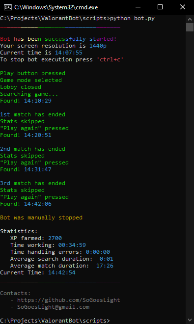

# Valorant bot

### Features! (Valorant v2.08 compatible :heavy_check_mark:)
- Completely safe UI bot, NOT a single injection to the game files - 0 bans since beginning of September.

- Already done:
    - Anti-afk simulation!
    - Relaunches game in case of error and continues working!
    - Handles game updates too!
    - Statistics!
    - ...
    - Goes well with pizza!
    
- Coming soon:
    - Timer with exit function
    - Support of different game modes
    - Trigger bot
    - App interface
    - Special mode "Bilbo Teabaggins"

Supposed only for Deathmatches  
Currently supports FullHD and QHD screens

## !!! Important disclaimer !!!
- Since we all have a different graphic settings - you can always just make your own screenshots and replace the default ones in the folder, according, to your resolution (full/qhd).

---

## Requirements:
- [Valorant](https://playvalorant.com/en-us/ "https://playvalorant.com/en-us/")
- [Python v3.7.9*](https://www.python.org/downloads/ "https://www.python.org/downloads/release/python-379/") 
(Please use it as the last non-bugfix version)  
[Direct link for Windows 10 installer*](https://www.python.org/ftp/python/3.7.9/python-3.7.9-amd64.exe)  
*Do not forget to check "Add Python to PATH"
- [PC](https://downloadmoreram.com/ "Go on, do it")
- Screen
- If you are using *Windows 10 Pro **N*** you need to add **Media Feature Pack** by going to  
`Start > Settings > Apps > Apps and features > Optional features > Add a feature`,  
 and then locate Media Feature Pack in the list of available optional features.

## Setup:
0. [**Download latest release**](https://github.com/sogoeslight/ValorantBot/archive/1.43.zip) and unzip it anywhere
1. Make sure you have python installed
2. Execute -> Installer.bat
3. Valorant -> Settings -> General -> Text Language: **English (United States)**
4. Valorant -> Settings -> Video -> Display Mode: **Windowed**;  
Resolution: your native resolution, so game should be on whole screen, but in window  
### Additional:
- If you want script to launch Valorant for you - set `valorant_is_opened` in /scripts/settings.py to `False`,  
but don't forget that it will open in the last used resolution and display mode!
- Also, you can adjust `average_valorant_load_time` 
and `average_match_load_time` (/scripts/settings.py 20 and 21 lines)

## Launch:
0. Execute -> Launcher.bat

## Hints:
- Press `ctrl+c` in console window to stop bot
- Launching it by simply `bot.py` may cause unpredictable errors

Since bot is graphically-based, if anything doesn't work for you - try next graphic quality settings:
- Everything: High
- Vignette: On
- Anti-Aliasing: MSAA 4x
- Anisotropic Filtering: 8x
- Improve Clarity: Off
- Experimental Sharpening: Off
- Bloom: On
- Distortion: On 

### You would help to this project by
- Simply leaving a star on this repo
- [Buying me a pizza](https://www.buymeacoffee.com/SoGoesLight)
- [Donating any amount](https://www.paypal.com/donate/?hosted_button_id=JDHGX3H6NL9LA)

### Contacts:
[E-mail](mailto:SoGoesLight@gmail.com)  
